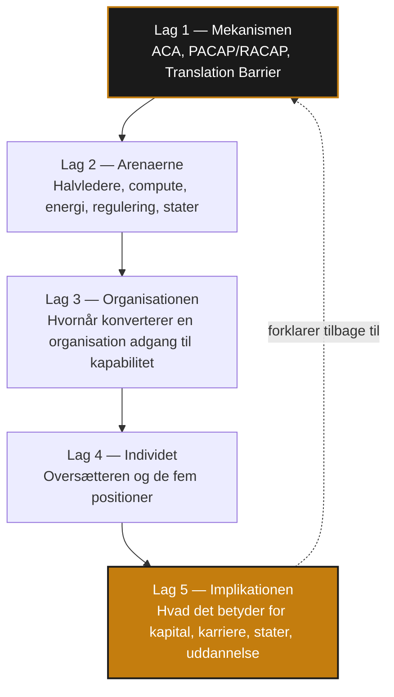
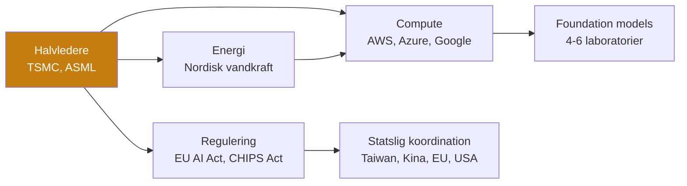
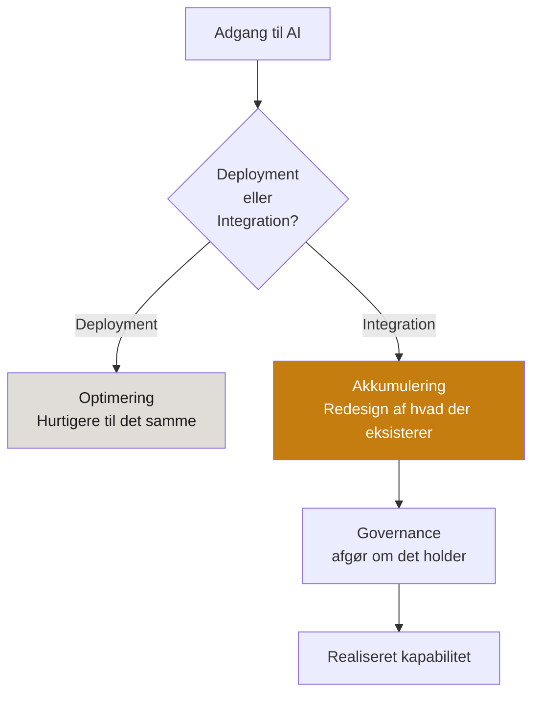
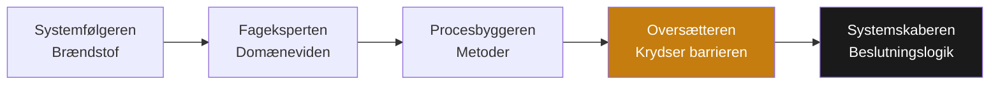
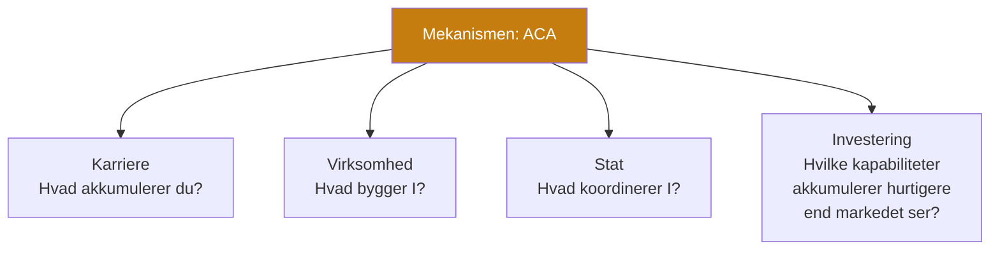

# The Engines Behind
## Strukturelt Framework — Projektinstruktion
### v3 — Renset for konsulentsprog, opdateret terminologi

---

Dette er ikke en indholdsoversigt.

Det er en analytisk arkitektur. En beskrivelse af hvordan bogens lag bygges — og hvorfor rækkefølgen er afgørende.

Hvert lag forudsætter det forrige. Hvert lag tilføjer noget det forrige ikke kunne vise. Tilsammen producerer de ikke en samling kapitler. De producerer et argument.

---

## Sammenhængen mellem lagene

Lag 1 giver mekanismen. Lag 2-4 demonstrerer den på tre størrelser — system, organisation, individ. Lag 5 samler det og viser konsekvensen. Pilen tilbage fra Lag 5 til Lag 1 er bevidst: konklusionen skærper forståelsen af mekanismen, den afslutter ikke bogen som en facitliste.

---

## Lag 1 — Mekanismen

*Formål: Etabler det analytiske fundament alt andet bygger på.*

Inden vi kan forklare hvorfor TSMC er svær at erstatte, hvorfor Toyota akkumulerede hvad konkurrenterne ikke kunne kopiere, eller hvorfor en organisation deployer AI uden at integrere det — skal vi definere mekanismen præcist.

**Asymmetrisk Kapabilitetsakkumulering (ACA)** er ikke en teori om adgang. Adgang til teknologi, kapital og infrastruktur bliver billigere for alle. ACA er en teori om konvertering: hvorfor nogle aktører omsætter adgang til akkumulerende operationel kapabilitet, mens andre med identisk adgang ikke gør det.

**PACAP og RACAP.** Potentiel absorptionskapacitet er hvad en aktør kan modtage og forstå. Realiseret absorptionskapacitet er hvad den faktisk konverterer til operationel virkelighed. De fleste aktører lever i PACAP. Konkurrencefordel lever i RACAP.

**Translation Barrier** er den grænse hvor de fleste stopper. Den er ikke teknisk. Den er arkitektonisk — et spørgsmål om hvem der beslutter hvad på baggrund af hvad, og om den beslutningsarkitektur er designet til at akkumulere eller blot til at fungere.

**Bottleneck-position** er kontrol over det kritiske punkt i en kæde alle andre er afhængige af. Rockefeller forstod det om jernbanerabatter. ASML forstår det om EUV-lithografi. Den aktør der kontrollerer bottlenecket, kontrollerer betingelserne for alle andres akkumulering.

**Governance** er transmissionsinfrastrukturen — det system der afgør om kapital, talent og teknologi konverteres til akkumulerende kapabilitet, eller forsvinder i friktion.

**Fragility Paradox** er den centrale spænding i bogens anden halvdel: den samme mekanisme der producerer styrke, producerer samtidig skrøbelighed. Det er ikke en bivirkning. Det er en strukturel konsekvens.

Dette lag skaber bogens forklaringsmodel. Uden det er resten cases. Med det er resten demonstrationer.

---

## Lag 2 — Arenaerne

*Formål: Vis mekanismen i de systemer der faktisk former verden.*

AI er ikke emnet. AI er det der accelererer en mekanisme der allerede fandtes — og presser den til at virke hurtigere med højere konsekvenser.

**Halvledere og compute.** TSMC, ASML og NVIDIA er ikke tilfældige vindere. De er resultatet af årtiers akkumulering ved præcis de rigtige bottlenecks. Amazon, Microsoft og Google ejer den infrastruktur andre organisationers digitale eksistens er betinget af.

**Energi.** AI's skjulte bottleneck. Datacentre kræver elektricitet i en skala der reshaper energimarkeder — og nordisk energigeografi er ved at blive en strategisk variabel.

**Regulering og industripolitik.** Ikke en ekstern variabel. En aktiv del af akkumuleringsarkitekturen. GDPR, AI Act, CHIPS Act er instrumenter stater bruger til at forme hvem der akkumulerer under hvilke betingelser.

**Statslig koordination.** Taiwan, Kina, EU og USA repræsenterer fire forskellige svar på det samme problem: hvordan koordinerer en stat teknologisk kapabilitet over tidshorisonter der overstiger valgcyklusser?

**Koncentration og afhængighed.** Hvert system i dette lag demonstrerer den samme mekanisme: den mest effektive position er den der er sværest at erstatte — og den der udgør den største systemiske risiko, hvis den fejler.

---

## Lag 3 — Organisationen

*Formål: Vis hvad der faktisk skal til for at en organisation akkumulerer.*

De fleste organisationer har adgang til AI. Få har RACAP.

**Deployment versus integration.** Deployment gør eksisterende processer hurtigere. Integration redesigner hvilke processer der eksisterer. BCG's data viser konsekvensen: integrerende virksomheder realiserer 1,7 gange højere omsætningsvækst — ikke fordi de er klogere, men fordi de akkumulerer mens andre optimerer.

**Det organisatoriske immunforsvar.** Den strukturelle mekanisme der automatisk afviser forandringer der truer eksisterende magtbalancer og informationsmonopoler — uafhængigt af om forandringen er rationel.

**Dataarkitektur, koordinationsarkitektur, beslutningsarkitektur.** De tre strukturelle betingelser der afgør om en organisation befinder sig på PACAP- eller RACAP-siden. Ingen af dem er IT-spørgsmål. Alle tre er akkumuleringsbetingelser.

**Institutionel læring.** Det der sikrer at viden akkumuleres i systemet, ikke kun i de enkeltpersoner der forsvinder, hvis de skifter job.

---

## Lag 4 — Individet

*Formål: Gør mekanismen personlig — uden at gøre den til selvhjælp.*

Absorptionskapacitetsteorien gælder ikke kun organisationer. Den gælder individer.

De fem positioner er ikke et hierarki af menneskelig værdi. De er fem funktioner — og en organisation der kun har de to sidste, akkumulerer hurtigt og fejler katastrofalt. En organisation der kun har de tre første, er stabil og langsomt irrelevant.

**Oversætteren** er den profil der krydser Translation Barrier — den der kan bevæge sig præcist mellem forretningslogik og systemlogik, og som begår det der i bogen kaldes arkitektonisk harakiri: designer sig selv ud af ligningen ved at bygge systemer andre kan bruge og forbedre.

**Tacit knowledge som beskyttelse.** Viden der er ikke-kodificerbar er det Dallas Fed-data viser stigende lønvækst for. Det er den samme mekanisme der gør Translation Barrier svær at automatisere væk.

**Stien der forsvinder.** AI erstatter entry-level opgaver — og entry-level opgaver er ikke kun arbejde, de er læreprocesser. Det er den mekanisme der afgør hvem der får mulighed for at blive Oversætter om ti år.

Individet analyseres ikke som en person med karrieremål. Det analyseres som et kapabilitetssystem med samme akkumuleringslogik som Lag 2 og 3. Det er distinktionen der holder dette lag analytisk, ikke motiverende.

---

## Lag 5 — Implikationen

*Formål: Syntese — ikke opsummering.*

De foregående fire lag har demonstreret mekanismen fra fire vinkler. Dette lag udleder konsekvensen for præcise aktørkategorier.

**For individet.** Spørgsmålet er ikke hvilke AI-værktøjer du bruger. Det er hvad du efterlader. Bygger du motoren, betjener du den, eller bliver du input til den?

**For organisationen.** Deployment versus integration er ikke et teknologispørgsmål. Det er et akkumuleringsspørgsmål — og de fleste organisationer gør det første og kalder det det andet.

**For staten.** Vælgercyklusser er fire år. Halvlederfabrikker tager ti. De stater der løser dette tidsproblem institutionelt frem for politisk, er dem der er relevante aktører om tyve år.

**For investoren.** Markedet ser produktet. Engines Behind ser akkumuleringsmaskinen bag produktet. Det er ikke investeringsrådgivning — det er et andet spørgsmål: ikke "hvilken virksomhed vinder", men "hvilke kapabiliteter akkumulerer hurtigere end konkurrenterne".

**For uddannelsessystemer.** Hvad producerer de — specialister der besidder PACAP, eller translatorer der bygger RACAP? Det er ikke retorisk. Det har præcise institutionelle implikationer.

Konklusionen samler trådene og viser hvad der kun er synligt, når alle fem lag er på plads. Det er ikke en handlingsplan. Det er en linse — og en linse ændrer hvad man ser, hver gang man bruger den.

---

*Strukturelt Framework — The Engines Behind*
*v3 — Renset for konsulentterminologi. Terminologi konsistent med MASTER_CONTEXT og det låste begrebsregister (ACA, PACAP/RACAP, Translation Barrier, Oversætteren, de fem positioner, Fragility Paradox).*
*Status: Aktiv projektvejledning*